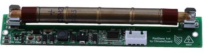

# MicroPython library for RadSens Geiger counter boards

[RadSensBoard](https://github.com/vurdalakov/mpy_radsensboard) is a MicroPython library for Raspberry Pi Pico that works with [RadSens Geiger counter boards](https://www.tindie.com/products/climateguard/dosimeter-board-with-i2c-radsens-board-arduino/).

* Library interface is similar to my [Arduino library for RadSens Geiger counter boards](https://github.com/vurdalakov/radsensboard).
* Tested with [Pimoroni MicroPython 1.19.14](https://github.com/pimoroni/pimoroni-pico/releases), [Raspberry Pi Pico W](https://www.raspberrypi.com/documentation/microcontrollers/raspberry-pi-pico.html) and [RadSens board 1.5](https://www.tindie.com/products/climateguard/dosimeter-board-with-i2c-radsens-board-arduino/) with CTC-5 tube.
* RadSensBoard library is distributed under the terms of the [MIT license](https://opensource.org/licenses/MIT).
* This project is not associated with nor sponsored by [ClimateGuard](https://climateguard.info/)
* RadSensBoard library repository is https://github.com/vurdalakov/mpy_radsensboard



## Example

1. Connect Raspberry Pi Pico to RadSens module according to the table below.
2. Upload `RadSensBoard.py` file to Raspberry Pi Pico.
3. Run the following code on Raspberry Pi Pico.

| RadSens Module |      Pico     |
|----------------|---------------|
| VCC            | 3V3  (pin 36) |
| GND            | GND  (pin 38) |
| SCL            | GP17 (pin 22) |
| SDA            | GP16 (pin 21) |


```python
from time import sleep
from machine import Pin, I2C
from RadSensBoard import RadSensBoard

i2c = I2C(0, scl=Pin(17), sda=Pin(16), freq=400000)

geiger = RadSensBoard(i2c)

print('Device information')
print(f'    Calibration value:    {geiger.get_calibration_value()}')
print(f'    HV generator state:   {geiger.get_high_voltage_generator_state()}')
print(f'    LED indication state: {geiger.get_led_indication_state()}')

while True:

    radiation_data = geiger.get_radiation_data()
    print('Radiation data')
    print(f'    Dynamic window: {radiation_data[0]:.3f}')
    print(f'    Fixed window:   {radiation_data[1]:.3f}')
    print(f'    Pulse count:    {radiation_data[2]}')

    sleep(5)
```

## Test and helper scripts

Test and helper Python scripts are located in the `test` directory.

Note that all these scripts require `DebugHelpers.py` and `RadSensBoard.py` files to be uploaded to device. 

#### Test scripts

* `TestDeviceConfiguration.py` - tests library methods that get and set RadSens board configuration.
* `TestRadiationData.py` - tests library methods that get radiation data from the RadSens board.
* `TestDeviceAddressChange.py` - tests library methods that changes RadSens board I2C address.

#### Helper scripts

* `DumpDevice.py` - prints RadSens board internal registers and configuration.
* `I2cDeviceScan.py` - scans connected I2C devices and prints their I2C addresses.
* `RestoreDeviceAddress.py` - automatically restores RadSens board default I2C address.

## Notes

#### Radiation levels with dynamic and fixed sliding windows

* According to RadSens board documentation, radiation level is calculated using both dynamic and fixed sliding windows.
* Dynamic sliding window (width is automatically adjusted to radiation level, and is less than 123 seconds) should be used when radiation level is rapidly changing (e.g. when searching for a local pollution source).
* Fixed sliding window (width is 500 seconds) should be used for accurate measurement of background radiation.

#### Pulse count

* Pulse count is accumulated by `RadSensBoard` object.
* When `RadSensBoard` object is created, pulse count is set to `0` .
* Call `reset_pulse_count()` method to reset pulse count to `0` at any moment.
* `get_radiation_data()` and `get_pulse_count()` methods return accumulated number of pulses since `RadSensBoard` object creation or `reset_pulse_count()` method call.

## Reference

#### Constructor

Creates and initializes a RadSensBoard object.

* `i2c` parameter should be set to a valid `machine.I2C` object.
* Optional `i2c_address` parameter should be used when connecting to RadSens board with non-default I2C address. Default value is `0x66`.

```python
# import Pin and I2C
from machine import Pin, I2C

# import RadSensBoard
from RadSensBoard import RadSensBoard

# I2C SCL pin is GP17 (pin 22); I2C SDA pin is GP16 (pin 21)
i2c = I2C(0, scl=Pin(17), sda=Pin(16), freq=400000)

# create RadSens board class with default I2C address
geiger = RadSensBoard(i2c)

# get radiation level based on dynamic sliding window
radiation_level = geiger.get_radiation_level_dynamic()
print(f"Radiation level: {geiger.get_radiation_level_dynamic():.3f} uSv/h")
```

#### is_valid()

Returns `True` if RadSense board is properly connected.

```python
geiger = RadSensBoard(i2c)
if geiger.is_valid():
    print(f'Pulse count: {geiger.get_pulse_count()}')
```

### Radiation data

#### get_radiation_data()

Returns a tuple with radiation data:
* radiation level based on dynamic window (uSv/h);
* radiation level based on fixed window (uSv/h);
* number of pulses since `RadSensBoard` object creation or `reset_pulse_count()` method call.

```python
radiation_data = geiger.get_radiation_data()
print('Radiation data')
print(f'    Dynamic window: {radiation_data[0]:.3f} uSv/h')
print(f'    Fixed window:   {radiation_data[1]:.3f} uSv/h')
print(f'    Pulse count:    {radiation_data[2]}')
```

#### get_radiation_level_dynamic()

Returns radiation level in uSv/h calculated using dynamic window.

```python
print(f'Radiation level: {geiger.get_radiation_level_dynamic():.3f} uSv/h')
```

#### get_radiation_level_fixed()

Returns radiation level in uSv/h calculated using fixed window.

```python
print(f'Radiation level: {geiger.get_radiation_level_fixed():.3f} uSv/h')
```

#### get_pulse_count()

Returns accumulated number of pulses since `RadSensBoard` object creation or `reset_pulse_count()` method call.

```python
print(f'Pulse count: {geiger.get_pulse_count()}')
```

#### reset_pulse_count()

Resets accumulated number of pulses to `0`.

```python
geiger.reset_pulse_count()
```

#### get_calibration_value()

Returns the Geiger sensor calibration value. Default value is `105` (average for SBM20-1 sensor).

Refer to RadSens board documentation for more information.

```python
print(f'Calibration value: {geiger.get_calibration_value()}')
```

#### set_calibration_value()

Sets the Geiger sensor calibration value. For SBM20-1 sensor calibration value should be between `100` and `110`.

```python
geiger.set_calibration_value(105) # set default value
```

### Device configuration

#### get_device_id()

Returns the device ID. Should be `0x7D`.

```python
print(f'Device ID: 0x{geiger.get_device_id():02X}')
```

#### get_firmware_version()

Returns the firmware version. In my case it is `2`.

```python
print(f'Firmware version: {geiger.get_firmware_version()}')
```

#### get_device_address()

Returns the device I2C address. Default value is `0x66`.

```python
print(f'Device I2C address: 0x{geiger.get_device_address():02X}')
```

#### set_device_address()

Sets the device I2C address.

```python
geiger.set_device_address(0x56)
```

#### get_high_voltage_generator_state()

Returns the high voltage generator state: `1` if it is on and `0` if it is off. Default value is `1`.

```python
print(f'HV generator state: {geiger.get_high_voltage_generator_state()}')
```

#### set_high_voltage_generator_state()

Sets the high voltage generator state.

* `state` parameter can be either `1` to set HV generator on, or `0` to set it off. All other values are ignored.

```python
geiger.set_high_voltage_generator_state(1) # turn HV generator on
```

#### get_led_indication_state()

Returns the state of the LED pulse indicator: `1` if LED flashes when pulse comes from Geiger sensor, or `0` if LED is always off. Default value is `1`.

```python
print(f'LED indication state: {geiger.get_led_indication_state()}')
```

#### set_led_indication_state()

Sets the state of the LED pulse indicator.

* `state` parameter can be either `1` to enable LED flash when pulse comes from Geiger sensor, or `0` to turn it off. All other values are ignored.

```python
geiger.set_led_indication_state(0) # turn LED off
```
